# ICT-Robotics

> A structured robotics portfolio and development repository covering robotic manipulation, autonomous mobile robotics, ROS 2, perception, simulation, navigation, and reinforcement learning.

---

## Overview

**ICT-Robotics** brings together hands-on robotics work across three major areas:

1. **SO-100 Robotic Arm** — ROS 2 integration, robot description, control, Gazebo simulation, and gripper-related control.
2. **TurtleBot3 Autonomous Robotics** — ROS 2, camera and LiDAR perception, sensor integration, SLAM, and Nav2-based navigation.
3. **Reinforcement Learning** — Isaac Sim / Isaac Lab based robotic simulation, navigation environments, training workflows, and experiment organization.

The repository is organized as a connected robotics development stack rather than as unrelated projects.

```text
Robot Hardware
      |
      v
ROS 2 Middleware
      |
      +-------------------+
      |                   |
      v                   v
Perception            Robot Control
      |                   |
      +---------+---------+
                |
                v
      Localization / Mapping
                |
                v
       Planning / Navigation
                |
                v
          Simulation
                |
                v
    Reinforcement Learning
                |
                v
    Intelligent Robot Behavior
```

---

# System Architecture

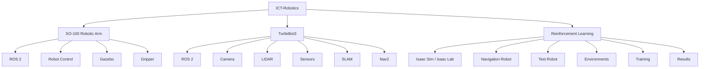

## Robotics Development Pipeline

```mermaid
flowchart LR
    A["Robot Platform"] --> B["Robot Description"]
    B --> C["ROS 2 Integration"]
    C --> D["Sensors / Perception"]
    D --> E["State Estimation"]
    E --> F["Mapping / Localization"]
    F --> G["Planning"]
    G --> H["Control"]
    H --> I["Simulation / Testing"]
    I --> J["Learning / Optimization"]
    J --> K["Evaluation"]
```

---

# Repository Structure

```text
ICT-Robotics/
|
+-- so100/
|   +-- ROS2/
|   +-- Camera/
|   +-- Control/
|   +-- Gripper/
|   +-- Gazebo/
|
+-- turtlebot/
|   +-- ROS2/
|   +-- Camera/
|   +-- Lidar/
|   +-- Sensors/
|   +-- Slam/
|   +-- Nav2/
|   +-- Perceptors/
|
+-- rl/
    +-- Environments/
    +-- Issac Sim Lab/
    |   +-- nav bot ict/
    |   +-- test bot ict/
    +-- Training/
    +-- Results/
```

> `Issac Sim Lab` is retained exactly as the current directory name. The official software names are **Isaac Sim** and **Isaac Lab**.

---

# 1. SO-100 Robotic Arm

## Overview

The SO-100 section contains work related to a 5-DOF robotic arm, including ROS 2 integration, robot description, control configuration, Gazebo simulation, and gripper-related control configuration.

### Technologies

- ROS 2
- URDF / Xacro
- ROS 2 Control
- Joint controllers
- Gazebo
- RViz
- Robot state publishing
- Controller spawning
- Gripper control

## Architecture

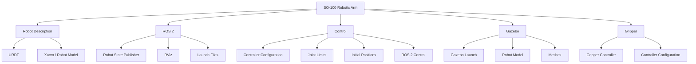

## Control Workflow

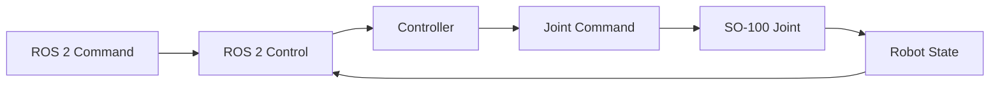

## Gazebo Workflow

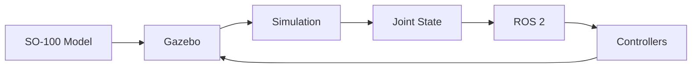

## Directory

```text
so100/
+-- ROS2/
|   +-- CMakeLists.txt
|   +-- package.xml
|   +-- hardware.launch.py
|   +-- rsp.launch.py
|   +-- rviz.launch.py
|   +-- spawn_controllers.launch.py
|
+-- Control/
|   +-- controllers.yaml
|   +-- controllers_5dof.yaml
|   +-- controllers_7dof.yaml
|   +-- initial_positions.yaml
|   +-- joint_limits.yaml
|   +-- ros2_controllers.yaml
|   +-- so_100_arm.ros2_control.xacro
|
+-- Gripper/
|   +-- controllers_5dof.yaml
|   +-- ros2_controllers.yaml
|
+-- Gazebo/
|   +-- gz.launch.py
|   +-- so_100_arm_5dof.urdf
|   +-- so_100_arm_5dof_hardware.urdf
|   +-- models/
|
+-- Camera/
```

---

# 2. TurtleBot3 Autonomous Robotics

## Overview

The TurtleBot section focuses on autonomous mobile robotics using ROS 2, perception, sensing, SLAM, and Nav2.

### Technologies

- ROS 2
- TurtleBot3
- Camera perception
- LiDAR perception
- Sensor interfaces
- SLAM
- Nav2
- RViz
- URDF

## Architecture

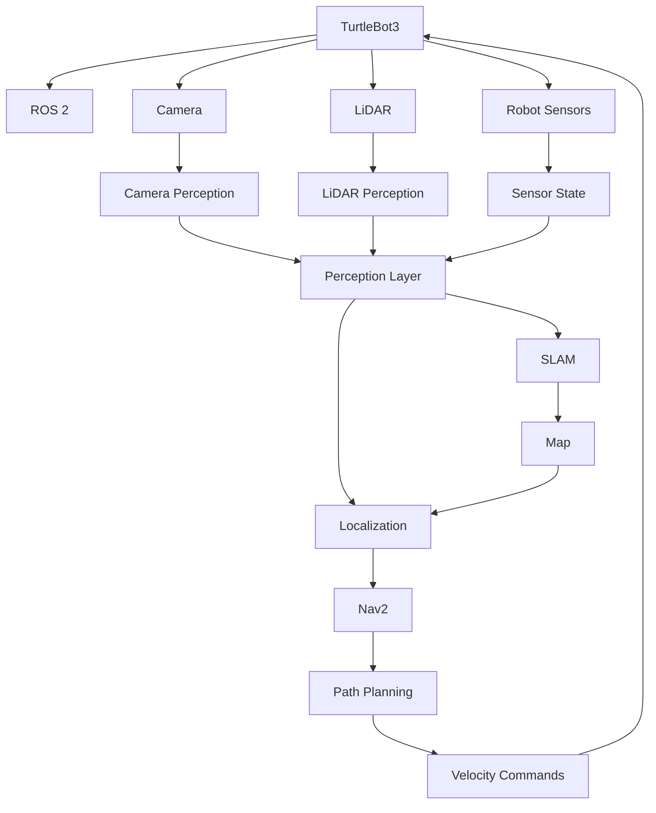

## ROS 2 Layer

```text
turtlebot/
+-- ROS2/
|   +-- turtlebot3_bringup/
|   +-- turtlebot3_description/
|   +-- turtlebot3_node/
|   +-- Perceptors/
```

### `turtlebot3_bringup`

```text
turtlebot3_bringup/
+-- launch/
+-- param/
+-- script/
+-- CHANGELOG.rst
+-- CMakeLists.txt
+-- package.xml
```

### `turtlebot3_description`

```text
turtlebot3_description/
+-- meshes/
+-- rviz/
+-- urdf/
+-- CHANGELOG.rst
+-- CMakeLists.txt
+-- package.xml
```

### `turtlebot3_node`

The node package contains robot-level functionality including device interfaces, motor power, odometry, IMU, joint state, battery state, sensor state, differential-drive control, and Dynamixel SDK integration.

---

## Camera Perception

```text
turtlebot/Camera/camera_perceptor.py
```

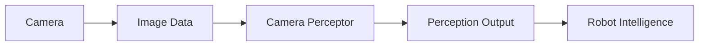

---

## LiDAR Perception

```text
turtlebot/Lidar/lidar_perceptor.py
```

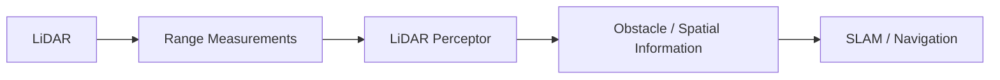

---

## Sensor Integration

Sensor functionality exists at two levels.

### Custom perception

```text
turtlebot/
+-- Camera/
+-- Lidar/
```

### TurtleBot ROS 2 sensor implementation

```text
turtlebot/ROS2/turtlebot3_node/
+-- include/turtlebot3_node/sensors/
+-- src/sensors/
```

This keeps underlying robot-driver functionality separate from higher-level perception.

---

# SLAM

```text
turtlebot/Slam/
+-- launch/
|   +-- mapping_tb3.launch.py
|   +-- slam_tb3.launch.py
+-- package.xml
+-- setup.py
```

## SLAM Pipeline

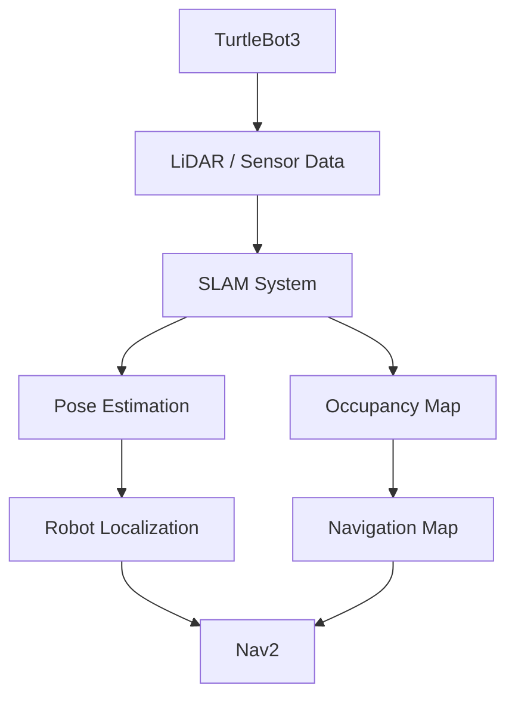

---

# Nav2

```text
turtlebot/Nav2/
+-- launch/
|   +-- nav2_tb3.launch.py
+-- parameters/
|   +-- nav2_params.yaml
+-- package.xml
+-- setup.py
```

## Navigation Pipeline

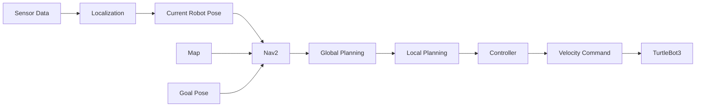

## End-to-End TurtleBot Workflow

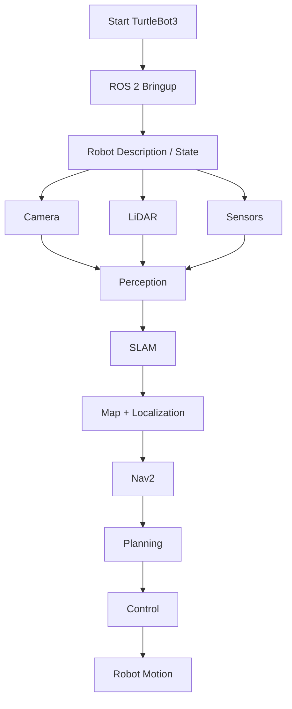

---

# 3. Reinforcement Learning

## Overview

The RL section contains Isaac Sim / Isaac Lab based robotics projects.

```text
rl/
+-- Environments/
+-- Issac Sim Lab/
|   +-- nav bot ict/
|   +-- test bot ict/
+-- Training/
+-- Results/
```

The two current project directories are kept intact under `Issac Sim Lab/` so their package relationships and dependencies are preserved.

---

# Isaac Sim / Isaac Lab Architecture

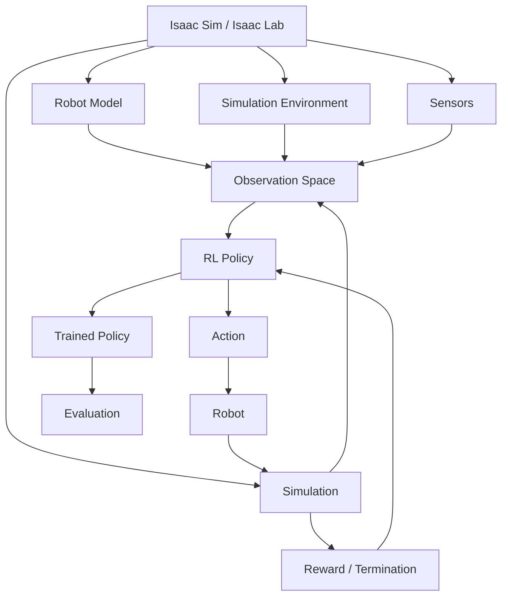

---

# Navigation RL Project

Location:

```text
rl/Issac Sim Lab/nav bot ict/
```

The navigation project contains robot assets, task definitions, MDP components, configuration, and scripts.

High-level structure:

```text
nav bot ict/
+-- .vscode/
+-- scripts/
+-- source/
```

The source tree contains navigation environment code, robot assets, target markers, obstacles, observations, curriculum, events, terminations, obstacle management, and agent configuration.

## Navigation Environment

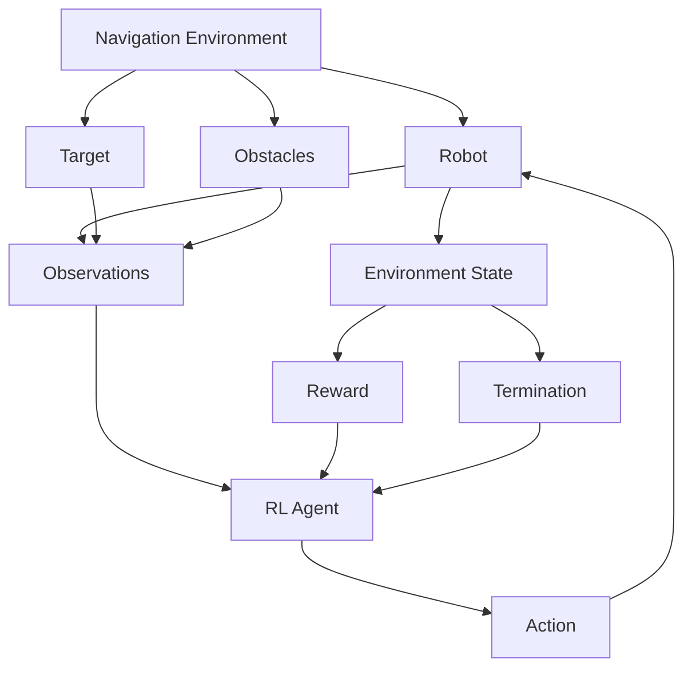

---

# Test Robot RL Project

Location:

```text
rl/Issac Sim Lab/test bot ict/
```

Current task organization:

```text
test bot ict/
+-- source/
    +-- ict_bot/
        +-- assets/
        +-- tasks/
            +-- a_move_straight/
            +-- b_reach_target/
            +-- c_obstacle_avoidance/
            +-- d_square_track/
```

## Task Architecture

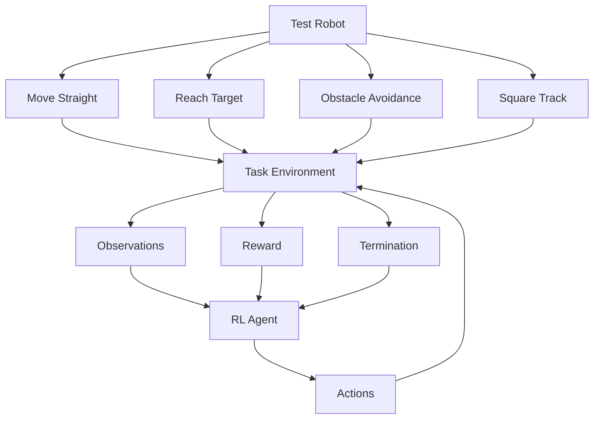

---

# RL Training Workflow

The current projects contain training/play scripts and agent configurations, including `skrl` workflows.

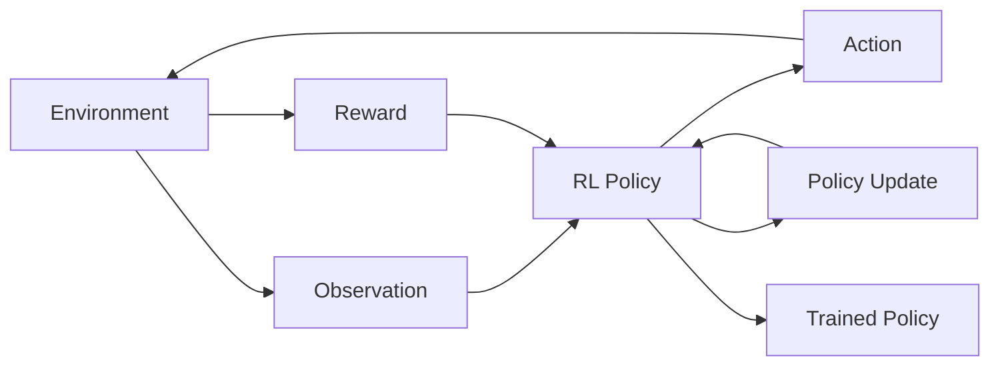

---

# Environments

```text
rl/Environments/
```

This directory is reserved for reusable or separately organized environment artifacts.

Project-specific environments remain with their current Isaac Sim / Isaac Lab projects until a clean separation is useful.

# Training

```text
rl/Training/
```

Reserved for:

- Training configurations
- Experiment scripts
- Policy configurations
- Training logs
- Evaluation scripts
- Reproducibility notes

# Results

```text
rl/Results/
```

Reserved for:

- Reward curves
- Success-rate curves
- Episode statistics
- Evaluation summaries
- Trained policy checkpoints
- Simulation recordings
- Comparison plots

No fabricated numerical results are included. Actual metrics should be added only after experiments generate them.

## RL Evaluation Loop

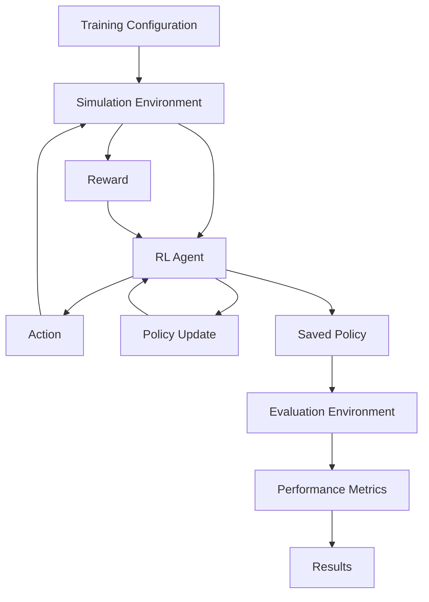

---

# Cross-System Technology Stack

| Category | Technologies / Components |
|---|---|
| Robotics Middleware | ROS 2 |
| Manipulation | SO-100 |
| Mobile Robotics | TurtleBot3 |
| Simulation | Gazebo, Isaac Sim, Isaac Lab |
| Robot Description | URDF, Xacro |
| Robot Control | ROS 2 Control, Controllers |
| Visualization | RViz |
| Navigation | Nav2 |
| Mapping | SLAM |
| Perception | Camera, LiDAR |
| Reinforcement Learning | RL environments, skrl workflows |
| Computing Platforms | Raspberry Pi, Jetson platforms |
| Programming | Python, C++, YAML, XML |
| Version Control | Git, GitHub |

---

# Project Relationship

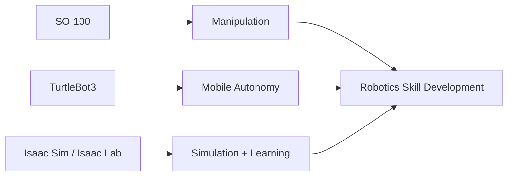

The SO-100 work emphasizes **manipulation and control**.

The TurtleBot3 work emphasizes **perception, mapping, navigation, and autonomous mobile robotics**.

The Isaac Sim / Isaac Lab work emphasizes **simulation, task environments, reinforcement learning, and evaluation**.

---

# End-to-End Robotics Workflow

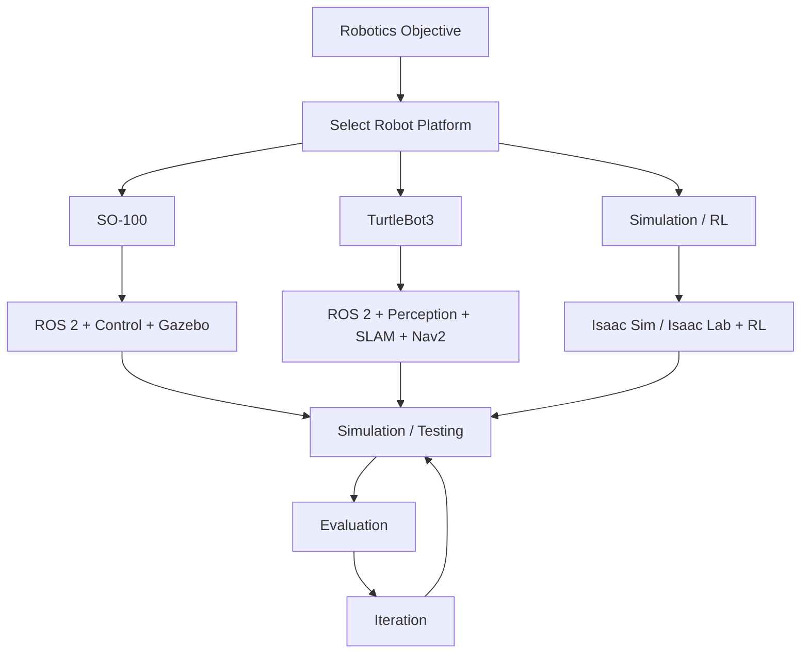

---

# Project Workflow

## SO-100

```text
1. Load robot description
2. Start ROS 2
3. Start robot state publisher
4. Configure controllers
5. Visualize in RViz
6. Launch Gazebo
7. Test robot control
8. Test gripper/control configuration
```

## TurtleBot3

```text
1. Start TurtleBot3 bringup
2. Load robot description
3. Start camera / LiDAR
4. Run perception components
5. Start SLAM
6. Generate map
7. Localize robot
8. Start Nav2
9. Provide navigation goal
10. Evaluate autonomous motion
```

## Reinforcement Learning

```text
1. Load Isaac Sim / Isaac Lab project
2. Select environment/task
3. Configure RL agent
4. Start training
5. Collect rewards and episode statistics
6. Save trained policy
7. Run evaluation
8. Store results
```

---

# Results and Metrics

When experimental data is available, the following metrics can be documented.

## Navigation

| Metric | Description |
|---|---|
| Goal Success Rate | Percentage of navigation episodes reaching the target |
| Collision Rate | Percentage of episodes involving collisions |
| Path Length | Distance traveled by the robot |
| Completion Time | Time required to complete a task |
| Localization Error | Difference between estimated and reference pose |

## Reinforcement Learning

| Metric | Description |
|---|---|
| Episode Reward | Cumulative reward per episode |
| Mean Reward | Average reward over an evaluation window |
| Success Rate | Percentage of successful episodes |
| Episode Length | Number of simulation steps per episode |
| Collision Count | Number of collision events |
| Training Progress | Change in performance over training |

> Numerical values should only be added after they are obtained from actual experiments.

---

# Visual Documentation

Recommended visual assets for future updates:

### SO-100
- Robot assembly photograph
- Gazebo simulation
- RViz visualization
- Controller demonstration

### TurtleBot3
- Robot setup
- Camera output
- LiDAR visualization
- SLAM-generated map
- Nav2 navigation

### Reinforcement Learning
- Isaac Sim environment
- Robot task visualization
- Training curves
- Evaluation results

Suggested future documentation layout:

```text
docs/
+-- images/
|   +-- so100/
|   +-- turtlebot/
|   +-- rl/
+-- diagrams/
|   +-- architectures/
|   +-- workflows/
+-- results/
    +-- training/
    +-- navigation/
```

---

# External Frameworks and References

This repository uses or organizes work around established robotics frameworks and platforms:

- **ROS 2** — Robot Operating System middleware
- **Navigation2 (Nav2)** — autonomous navigation framework for ROS 2
- **TurtleBot3** — mobile robotics platform
- **Gazebo** — robotics simulation
- **Isaac Sim** — robotics simulation platform
- **Isaac Lab** — robot learning framework built around Isaac Sim
- **ROS 2 Control** — robot hardware/control framework
- **RViz** — ROS visualization tool
- **SLAM** — simultaneous localization and mapping

Project-specific code should be distinguished from upstream framework code, with applicable licenses and attribution preserved.

---

# References

- [ROS 2](https://docs.ros.org/)
- [ROS 2 Control](https://control.ros.org/)
- [Navigation2](https://navigation.ros.org/)
- [TurtleBot3](https://emanual.robotis.com/docs/en/platform/turtlebot3/)
- [Gazebo](https://gazebosim.org/)
- [Isaac Sim](https://developer.nvidia.com/isaac/sim)
- [Isaac Lab](https://github.com/isaac-sim/IsaacLab)

---

# Repository Maintenance

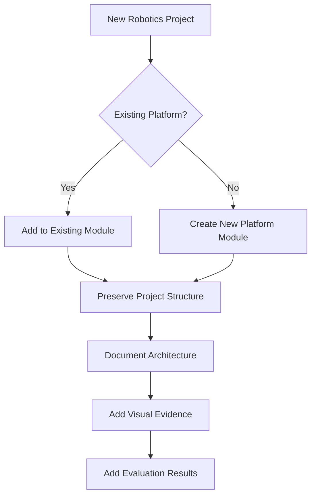

Recommended practices:

- Keep project-specific files with their project.
- Preserve upstream licenses and attribution.
- Use descriptive commit messages.
- Document setup requirements.
- Add screenshots or videos when useful.
- Add quantitative results only when they come from real experiments.
- Avoid copying entire external frameworks into the repository.

---

# Current Repository Status

| Module | Focus | Status |
|---|---|---|
| `so100/` | Robotic arm, ROS 2, control, Gazebo | Project archive |
| `turtlebot/` | Perception, sensors, SLAM, Nav2 | Project archive |
| `rl/` | Isaac Sim / Isaac Lab and RL projects | Project archive |

Current RL organization:

```text
rl/
+-- Environments/
+-- Issac Sim Lab/
|   +-- nav bot ict/
|   +-- test bot ict/
+-- Training/
+-- Results/
```

---

# Future Development

Potential extensions include:

- More advanced SO-100 manipulation tasks
- Camera-based robotic perception
- Additional TurtleBot sensor integrations
- Improved SLAM and navigation workflows
- Autonomous manipulation
- Reinforcement-learning based navigation
- Sim-to-real experimentation
- Quantitative navigation evaluation
- Training-result visualization
- Hardware deployment and benchmarking
- Integrated perception-to-action pipelines

---

# Author

**Rishi Sampat**

B.Tech — Information and Communication Technology  
Marwadi University

Areas of interest:

- Robotics
- ROS 2
- Autonomous Systems
- Artificial Intelligence
- Machine Learning
- Computer Vision
- Embedded Systems
- Reinforcement Learning
- Intelligent Robotics

[GitHub Profile](https://github.com/Rishi-Sampat)

[ICT-Robotics Repository](https://github.com/Rishi-Sampat/ICT-Robotics)

---

# License and Attribution

This repository brings together project-specific robotics work, adapted components, and references to external robotics frameworks.

Where external repositories or frameworks are used:

1. Preserve their original licenses.
2. Provide appropriate attribution.
3. Do not represent upstream framework code as original work.
4. Document project-specific modifications where appropriate.

Refer to the license and attribution information included with individual project sources where applicable.

---

# Closing

**ICT-Robotics** is intended to be a continuously evolving record of robotics development across manipulation, mobile autonomy, simulation, and reinforcement learning.

```text
SO-100
  |
  +--> Manipulation
  +--> ROS 2
  +--> Control
  +--> Gazebo
```

```text
TurtleBot3
  |
  +--> Perception
  +--> Camera
  +--> LiDAR
  +--> SLAM
  +--> Nav2
  +--> Autonomous Navigation
```

```text
Isaac Sim / Isaac Lab
  |
  +--> Simulation
  +--> Environments
  +--> Reinforcement Learning
  +--> Training
  +--> Evaluation
```

Together, these projects form a practical robotics development pipeline spanning **robot modeling, middleware, sensing, perception, control, mapping, navigation, simulation, and learning**.
